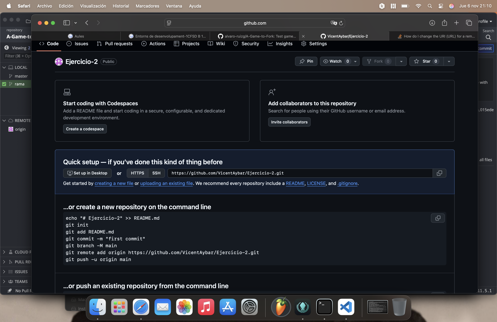
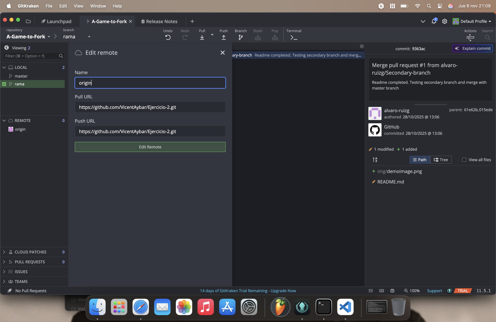
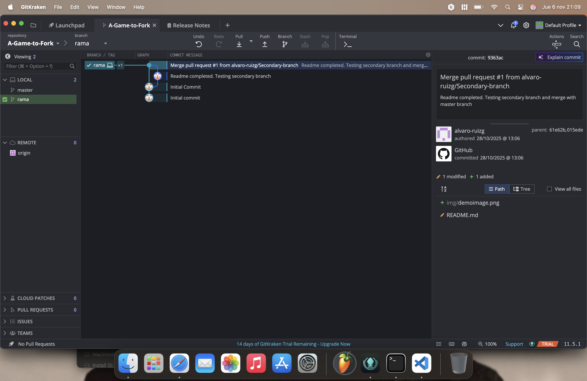
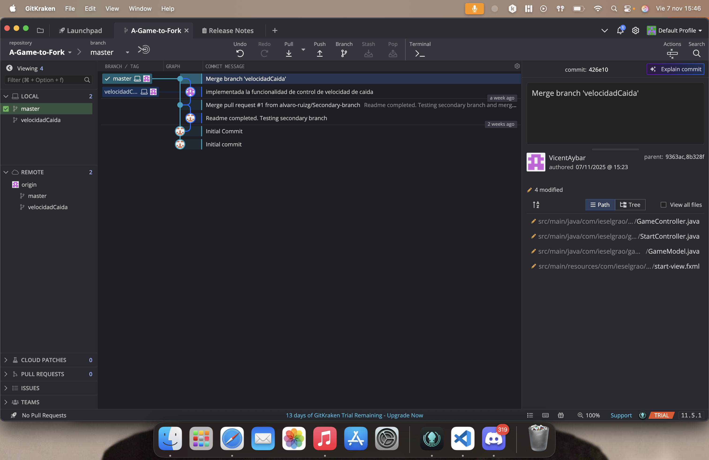
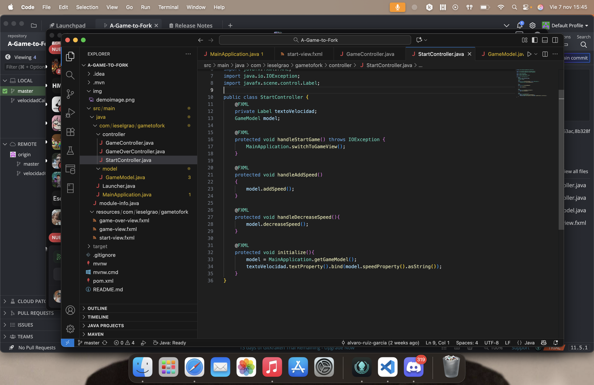

Antes de nada quiero decir que para este ejercicio me ha ayudado mi hermano mayor, porque se me ha complicado muchisimo este ejercicio ya que no comprendo la mayoria de los terminos que se usan en el codigo. En mi opinion creo que ha sido una tarea complicada y que la he podido sacar adelanta gracias a la ayuda que dispongo.

# Creacion del Repositorio

- He creado un repositorio en GitHub y he instalado git kraken. He clonado el repositorio original en mi ordenador y GitKraken y he modificado el origen del repositorio y he creado una nueva rama en el repositorio. 

# Edicion del codigo
- Despues de esto, he ido al codigo y he añadido la funcion de cambiar la velocidad de los circulos, añadiendo variables como fallSpeed y funciones como addSpeed.

- Luego he añadido una variable GameModel llamada model, en las funciones nuevas como handleAddSpeed.

- Y finalmente, con el xtml y el css he añadido los botones para cambiar la velocidad.

